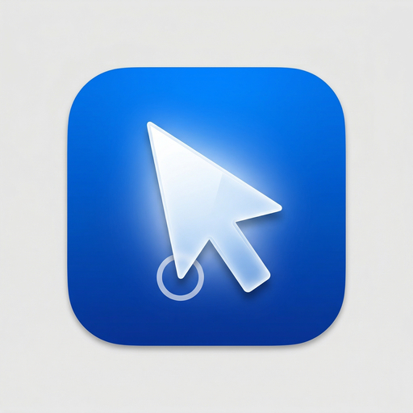

<p align="center">
  <br />
  
  <br />
</p>

<h1 align="center">Runthroo</h1>

<p align="center">
  <strong>Build pixel-perfect, interactive product demos in seconds.</strong><br>
  Capture any web application with full fidelity, build non-linear interactive journeys,<br>and export self-contained HTML files anyone can open.
</p>

<br>

<p align="center">
  <video src="https://github.com/AissaM7/Runthroo/raw/main/landing/demo32.mp4" width="850" autoplay loop muted playsinline></video>
</p>

<br>

<p align="center">
  <a href="#what-is-runthroo">Overview</a> &middot;
  <a href="#user-guide">User Guide</a> &middot;
  <a href="#features">Features</a> &middot;
  <a href="#quick-start">Quick Start</a> &middot;
  <a href="#building-from-source">Build from Source</a>
</p>

<br><br>

<h2 align="center">What is Runthroo?</h2>

Runthroo is a free, open-source macOS desktop application that lets you create **interactive click-through demos** of any website or web application. It is a fully local, privacy-first alternative to tools like Navattic, Reprise, and Storylane — with no accounts, no cloud uploads, and no vendor lock-in.

> Unlike screen recorders or screenshot stitchers, Runthroo works by **serializing the actual DOM and CSS** of live web pages. This produces crisp, infinitely scalable replicas that look and behave identical to your real product.

<br><br>

---

<br><br>

<h2 align="center">User Guide</h2>

This guide covers everything from installing the capture extension to building and exporting your first interactive demo.

<br>

### 1. Installs & Security

Runthroo consists of two components: the **macOS desktop app** and the **Chrome capture extension**.

**macOS Desktop App — Installation & Security Bypass**

Download the newest `.dmg` from the [Releases](https://github.com/AissaM7/Runthroo/releases) and drag Runthroo to your Applications folder.

> **macOS Security Warning**  
> Because Runthroo is not distributed through the Mac App Store, macOS will block it on the first launch. You will see a dialog stating **"Runthroo" Not Opened**. This is completely normal for open-source apps. 

**How to bypass Gatekeeper:**
1. Click **Done** on the warning dialog.
2. Open **System Settings &rarr; Privacy & Security** and scroll down.
3. Click the **Open Anyway** button next to the blocked message.
4. Click **Open Anyway** on the final confirmation.

<p align="center">
  
</p>

<br>

**Chrome Capture Extension**

The Chrome extension is required to clone web architectures in real-time.

1. Download `runthroo-extension.zip` from the [Releases](https://github.com/AissaM7/Runthroo/releases) and tightly extract it.
2. Open Google Chrome and go to `chrome://extensions`.
3. Toggle **Developer mode** ON in the top right corner.
4. Click **Load unpacked** and select the unpacked extension folder.

<p align="center">
  <br>
  
  <br>
</p>

### 2. Capturing Pages

With the desktop app running, you can capture full-fidelity replicas of any web page.

**Single Page Capture**  
Navigate to any page, click the Runthroo extension icon, and select **Capture Current Page**. 

<p align="center">
  
</p>

**Recording Multi-Step Demos**  
To capture a full flow, click **Start Recording**. As you navigate your app normally, Runthroo will automatically capture every page you visit. Click **Stop Recording** when finished.

<p align="center">
  
</p>

<br>

### 3. The Library & Editor

**Library**  
All your captured pages automatically appear in the desktop app's Library, organized by platform.

<p align="center">
  <br>
  
  <br>
</p>

**Interactive Editor**  
Create a new Demo and add your captured pages. In the editor, you can:
- **Draw Click Zones:** Define interactive areas that link to the next step
- **Redact Data:** Add frosted glass blurs over sensitive PII
- **Edit Text:** Change any names or values on the page to personalize the demo

<p align="center">
  <br>
  
  <br>
</p>

<br>

### 4. Branching Logic

If your product flow isn't strictly linear, you can add multiple interactive paths to a single step so viewers can organically explore different features.

<p align="center">
  <br>
  
  <br>
</p>

<br>

### 5. Export and Share

When your demo is ready, just click **Export**. 

Runthroo generates a single, self-contained `.html` file containing the entire interactive replica of your app. Send it via email, Slack, or host it anywhere — viewers simply double-click to open it in their browser with zero dependencies required.

<p align="center">
  <br>
  
  <br>
</p>

<br><br>

---

<br><br>

<h2 align="center">Features</h2>

### Capture Engine

| Capability | Description |
|---|---|
| **True DOM Serialization** | The Chrome extension captures the full HTML structure, computed styles, fonts, and images of any page — not a screenshot or video. |
| **CORS Bypass** | Built-in declarative net request rules automatically handle cross-origin assets (fonts, stylesheets, images) so captures render correctly. |
| **Platform Tagging** | Organize captures by product or platform name for easy retrieval across large libraries. |
| **Automatic Thumbnails** | Every capture generates a high-quality thumbnail preview for visual browsing. |

<br>

### Flow Editor

| Capability | Description |
|---|---|
| **Interactive Click Zones** | Draw rectangular click targets over any element. When viewers click the correct area, they advance to the next step. Wrong clicks trigger a subtle guidance pulse. |
| **Non-Linear Branching** | Build demos with multiple clickable paths per step so users can explore different product flows organically. |
| **Native Data Redaction** | Apply frosted-glass blur overlays to sensitive PII or proprietary data directly within the editor, without degrading the surrounding page fidelity. |
| **Inline Text Editing** | Modify any visible text content on captured pages — change names, values, or labels to personalize demos for specific prospects. |
| **Custom Cursor Animation** | Configure animated cursor movement between steps for a polished, guided experience during playback. |
| **Auto-Play Delays** | Set timed transitions between steps for hands-free, kiosk-style presentations. |
| **Step Reordering** | Drag-and-drop steps in the timeline to restructure demo flows instantly. |
| **Scroll-Aware Positioning** | Click zones remain perfectly anchored to their target elements regardless of page scroll position. |

<br>

### Export & Application
| Capability | Description |
|---|---|
| **Single-File HTML Export** | Export your entire demo as one self-contained `.html` file. |
| **Zero Dependencies** | Exported files run in any modern browser with no server required. |
| **First-Launch Walkthrough** | Integrated onboarding guide walks new users through setup. |
| **100% Local** | All data is stored in a local SQLite database. Nothing is transmitted. |

<br><br>

---

<br><br>

<h2 align="center">Quick Start</h2>

### Prerequisites

- **Node.js** v18 or later
- **npm** v9 or later
- **Google Chrome** (for the capture extension)
- **macOS** (desktop app is currently built for Mac)

### Clone and Run from Source

```bash
git clone https://github.com/AissaM7/Runthroo.git
cd Runthroo
npm install
npm run rebuild
npm run dev
```

> The `rebuild` command recompiles `better-sqlite3` for your local Electron version.

<br><br>

---

<br><br>

<h2 align="center">Architecture & Stack</h2>

### Development

```bash
npm run dev          # Launch the app in development mode with hot reload
npm run build        # Compile the production bundle
```

### Project Structure

```
Runthroo/
├── electron/                  # Electron main process
│   ├── main.ts                # App entry, window management, IPC handlers
│   ├── preload.ts             # Context bridge for renderer
│   └── services/              # Local server, DB, image processing, export
├── src/                       # React renderer process
│   ├── App.tsx                # Root layout
│   ├── components/            # UI components and onboarding logic
│   ├── views/                 # Library, Editor, and Export screens
│   └── stores/                # Zustand state management
├── extension/                 # Chrome extension source
│   ├── manifest.json          # Manifest V3 configuration
│   ├── popup/                 # Extension popup UI
│   └── content/               # DOM serialization agent
├── landing/                   # Public landing page (runthroo.vercel.app)
└── package.json
```

### Tech Stack

| Layer | Technology |
|---|---|
| **Desktop Shell** | Electron 30 |
| **Frontend** | React 19, TypeScript, Tailwind CSS |
| **State** | Zustand |
| **Database** | better-sqlite3 |
| **Assets/Images** | Sharp |
| **Bundler** | electron-vite, Vite 5 |
| **Extension** | Chrome Manifest V3 |

<br><br>

---

<br><br>

<h2 align="center">Creating the Mac Installer</h2>

To package the app as a distributable `.dmg` file:

```bash
npm run dist
```

This compiles the frontend, packages the SQLite binaries, signs the application, and generates the drag-to-install `.dmg` image in `/dist`.

**Notarization (Optional)**

If you have an Apple Developer account, you can notarize the app so macOS trusts it without security warnings:

```bash
export APPLE_ID="your@email.com"
export APPLE_APP_SPECIFIC_PASSWORD="xxxx-xxxx-xxxx-xxxx"
export APPLE_TEAM_ID="YOUR_TEAM_ID"
npm run dist
```

<br><br>

---

<br><br>

<h2 align="center">Contributing & License</h2>

Contributions are welcome. Feel free to open issues, submit pull requests, or suggest new features.

This project is licensed under the GNU Affero General Public License v3.0 (AGPL-3.0). It is free for personal and non-commercial use. Any commercial use, resale, or incorporation into a paid product requires a separate commercial license — contact aissamamdouh14@gmail.com directly.
